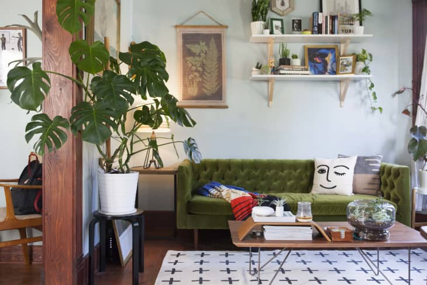
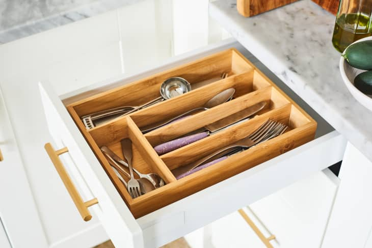
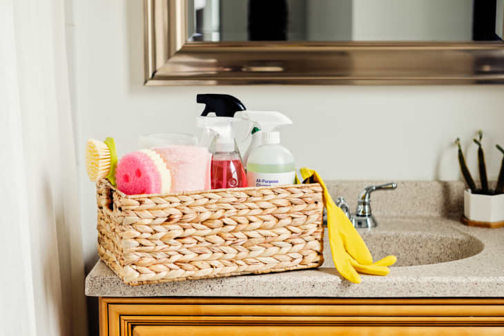
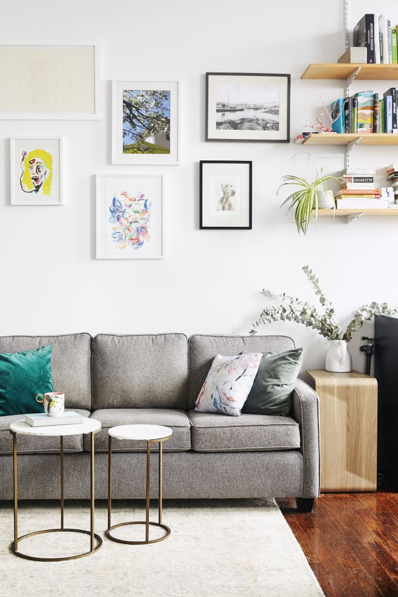

<html lang="en" dir="ltr">
  <head>
    <meta charset="utf-8">
    <title>HOME</title>
    
  </head>
  <body>
    <h1><strong>Things Everyone Should Have At Home Somewhere</strong></h1> 
    
Home may be where the heart is—but it should also be where you keep a lot of other important stuff, too.
 

    <h2><b>Tools & Supplies</b></h2>
  <ul>
    <li>A flathead screwdriver</li>
    <li>A Phillips head screwdriver</li>
    <li>Pliers</li>
    <li>An electric screwdriver or power drill</li>
    <li>A hammer</li>
</ul> 

 

<h2><b>Kitchen Equipment</b></h2>
<ul>
  <li>Dish cloths</li>
  <li>A dish scrub brush or sponge</li>
  <li>Pot holders or oven mitts</li>
  <li>A skillet</li>
  <li>A measuring cup</li>
</ul> 

 

<h2><b>Cleaning Supplies</b></h2>
<ul>
  <li>All-purpose cleaner</li>
  <li>Disinfecting wipes</li>
  <li>Window cleaner</li>
  <li>A hand duster</li>
  <li>A detail brush</li>
</ul> 

 

<h2><b>Furniture</b></h2>
<ul>
  <li>A comfortable place to sit </li>
  <li>A coffee/side table (to set stuff on)</li>
  <li>A mattress (that doesn’t hurt your back to sleep on)</li>
  <li>A bed frame</li>
  <li>A good pillow </li>
</ul> 

<h2><strong><i><a href="https://www.apartmenttherapy.com/household-items-36642111">More Information</a></i></strong></h2>

  </body>
</html>
